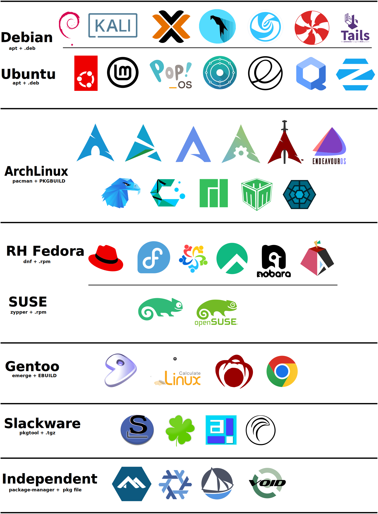

<Post authors="David7ce"/>

## Overview

Linux is not a single operating system — it is a kernel around which thousands of distributions have been built. A **distribution** (or *distro*) bundles the Linux kernel with a package manager, init system, desktop environment, and default software to create a complete, usable OS.

Choosing a distro means choosing a philosophy: rolling releases or stable snapshots, binary packages or source compilation, curated defaults or complete freedom. Understanding the family tree helps navigate those choices, since most distros inherit tools, repositories, and conventions from a common ancestor.

<!-- The diagram below shows how the main distributions relate to each other by base:

<figure>
  
  <figcaption style="text-align:center;font-size:.85em;color:var(--vp-c-text-2);margin-top:.5em;">Linux family-based distribution table</figcaption>
</figure> -->

---

## Distribution Families

The table below covers the distributions present in the family diagram above.

|     Family      | Distros                                                                                                                                                                                                                                                                                                                                                                                                                                                                                                                                                                                                                                                                                                                                                                                                                                                                                                                                                                                                                                                                                                                                                                                                                                                                                                                        |      Package Manager      |
|:---------------:|--------------------------------------------------------------------------------------------------------------------------------------------------------------------------------------------------------------------------------------------------------------------------------------------------------------------------------------------------------------------------------------------------------------------------------------------------------------------------------------------------------------------------------------------------------------------------------------------------------------------------------------------------------------------------------------------------------------------------------------------------------------------------------------------------------------------------------------------------------------------------------------------------------------------------------------------------------------------------------------------------------------------------------------------------------------------------------------------------------------------------------------------------------------------------------------------------------------------------------------------------------------------------------------------------------------------------------|:-------------------------:|
|    **Arch**     |        | `pacman` / `.pkg.tar.zst` |
|   **Debian**    |                                                                                                                                                                                                                                                                                                                                                                                                                                                                     |      `apt` / `.deb`       |
|   **Fedora**    |                                                                                                                                                                                                                                                                                                                                                                                                                                                                                                                                                                                                                                      |      `dnf` / `.rpm`       |
|    **SUSE**     |                                                                                                                                                                                                                                                                                                                                                                                                                                                                                                                                                                                                                                                                                                                                                                                                                                                                                                                                                                                                            |     `zypper` / `.rpm`     |
|   **Gentoo**    |                                                                                                                                                                                                                                                                                                                                                                                                                                                                                                                                                                                                                                                                                                                                                                                                                                                                                                                                                                                                                                   |    `emerge` / `EBUILD`    |
|  **Slackware**  |                                                                                                                                                                                                                                                                                                                                                                                                                                                                                                                                                                                                                                                                                                                                                                                                                                                                                                                                                                                                                                                                                                                                                                            |    `pkgtool` / `.tgz`     |
|   **Alpine**    |                                                                                                                                                                                                                                                                                                                                                                                                                                                                                                                                                                                                                                                                                                                                                                                                                                                                                                                                                                                                                                                                                                                                                                 |      `apk` / `.apk`       |
| **Independent** |                                                                                                                                                                                                                                                                                                                                                                                                                                                                                                                                                                                                                                                                                                                                                                                                                                                                                                           | `nix` / `xbps` / `eopkg`  |

### Debian

The oldest actively maintained major distro (1993). Renowned for rock-solid stability, the largest community-maintained package archive (~60,000 packages), and its strict free-software policy. Uses **APT** with `.deb` packages.

The Debian family is the most widely used base on servers, desktops, embedded systems, and live/security distros alike.

### Arch Linux

A rolling-release distro that ships the latest stable software the moment it is packaged. No installer GUI, no predefined desktop — users build exactly what they need. Uses **pacman** with `.pkg.tar.zst` packages and the **AUR** (Arch User Repository), the largest community software source on Linux.

Derivatives typically add graphical installers and curated defaults on top of the Arch base.

### Red Hat / Fedora

Red Hat (founded 1993) pioneered commercial Linux. **Fedora** is the upstream community release where new features land before they stabilise into **RHEL** (Red Hat Enterprise Linux). Both use **DNF** with `.rpm` packages. Rocky Linux and AlmaLinux are RHEL-compatible rebuilds maintained by the community after CentOS was discontinued.

### SUSE

Originating in Germany (1992), SUSE produces both **SUSE Linux Enterprise (SLE)** for enterprise workloads and the community **openSUSE** project. The flagship tool is **YaST**, a comprehensive system management suite. Package manager: **zypper** with `.rpm`.

### Gentoo

A source-based distro where every package is compiled locally from source using the **Portage** build system and **emerge** command. Extreme customisation and performance optimisation at the cost of build time. Derivatives like Redcore add binary caching to lower the barrier.

### Slackware

The oldest surviving Linux distribution (1993, Patrick Volkerding). Deliberately minimal: no automatic dependency resolution, no complex tooling — just tarballs and shell scripts. Uses **pkgtool** with `.tgz` packages. Teaches Linux from first principles.

### Alpine Linux

An ultra-lightweight distribution (~5 MB base) built on **musl libc** and **BusyBox** instead of the GNU toolchain. Favoured for container images and embedded systems due to its minimal attack surface. Package manager: **apk**.

### Independent

Some distributions reject inheritance entirely and establish their own tooling:

- **NixOS** — declarative, reproducible system configuration via the **Nix** package manager. The entire OS is described in `.nix` files; rollback to any previous state is always possible.
- **Void Linux** — independent, rolling, using the **XBPS** package manager and the **runit** init system instead of systemd.
- **Solus** — desktop-first independent distro, historically known for the **Budgie** desktop and the **eopkg** package manager.

---

## Further Reading

- [DistroWatch](https://distrowatch.com/) — rankings, news, and reviews for hundreds of distributions
- [Linux Comparison (eylenburg)](https://eylenburg.github.io/linux_comparison.htm) — detailed feature comparison across hundreds of distros
- [Linux Journey](https://linuxjourney.com/) — free interactive guide to learning Linux from scratch
