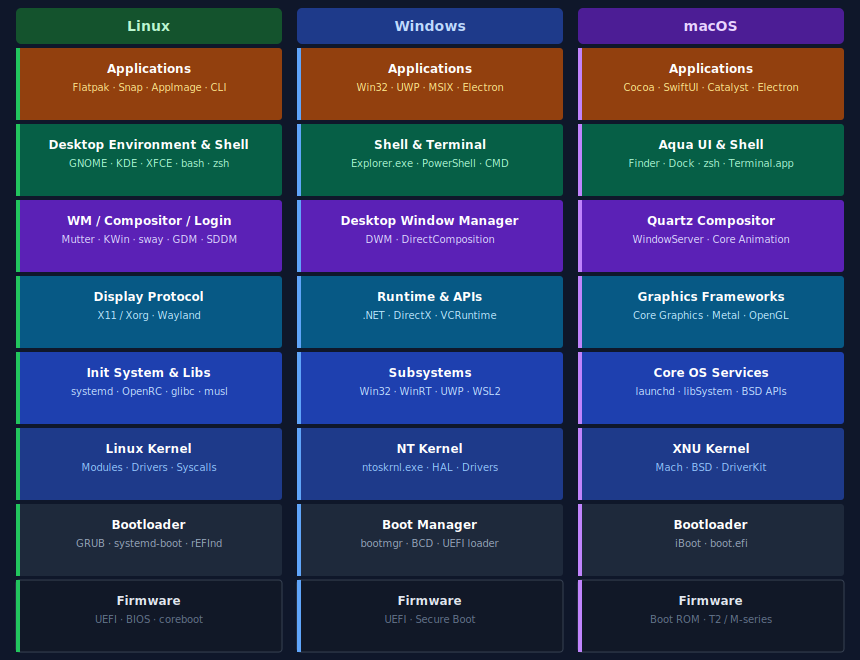

<Post authors="David7ce"/>

## Overview

Every operating system is a stack — a vertical tower of software layers, each one building on the layer below. When you click an icon and an app opens, you are triggering a chain of calls that travels from your application code down through the desktop environment, display server, system libraries, kernel, and into hardware. What differs between Linux, Windows, and macOS is not the concept but the specific components in each layer and how modular or monolithic the design is.

Linux is the most layered and interchangeable: nearly every component can be swapped independently. Windows is designed as a cohesive product where each layer is tightly integrated. macOS sits in the middle: a hybrid kernel and proprietary frameworks, but with roots in open-source BSD and Mach.

The diagram below aligns the layers of all three systems side by side, from firmware at the base to applications at the top. This article focuses on **desktop and server operating systems** — mobile platforms (Android, iOS) share some of the same foundations but have sufficiently different user-space stacks to deserve their own treatment.

<figure>
  
  <figcaption style="text-align:center;font-size:.85em;color:var(--vp-c-text-2);margin-top:.5em;">Software layer stack — Linux · Windows · macOS (bottom = hardware side)</figcaption>
</figure>

---

## Firmware

The firmware is the first code that runs when you press the power button. It initialises the hardware and hands off control to the bootloader.

- **Linux** — supports **UEFI** (the modern standard), legacy **BIOS**, and open-source alternatives like **coreboot** / **libreboot** used in some laptops (Thinkpads, Chromebooks). Because Linux supports a wide hardware range, firmware compatibility is a first-class concern.
- **Windows** — requires **UEFI** on modern installs (with Secure Boot mandatory on Windows 11). BIOS mode (CSM) is still supported for legacy hardware but deprecated.
- **macOS** — Apple controls both hardware and firmware. Apple Silicon Macs use a custom **Boot ROM** baked into the SoC. Intel Macs used EFI with the **T2 security chip** acting as a co-processor for secure boot and storage encryption.

---

## Bootloader

The bootloader locates the OS kernel on storage and loads it into memory.

- **Linux** — multiple independent bootloaders exist. **GRUB** is the default on most distributions; **systemd-boot** is minimal and UEFI-native; **rEFInd** is popular for dual-boot setups. The modularity means users can replace their bootloader freely.
- **Windows** — uses **bootmgr** (Windows Boot Manager) controlled via the **BCD** (Boot Configuration Data) store. It is bundled with the OS and not user-replaceable in normal operation.
- **macOS** — uses **iBoot** on Apple Silicon and **boot.efi** on Intel. The bootloader is tightly integrated with Apple's security chain (Secure Enclave, SIP) and cannot be replaced without disabling security features.

---

## Kernel

The kernel is the core of the OS: it manages processes, memory, hardware drivers, and system calls.

- **Linux** — the **Linux kernel** (monolithic with loadable modules). Drivers are shipped as kernel modules that can be loaded and unloaded at runtime. The kernel is developed openly and supports thousands of hardware configurations. Android also uses the Linux kernel, but replaces the entire user space (glibc → Bionic, systemd → init/Zygote, X11/Wayland → SurfaceFlinger) making it a distinct platform.
- **Windows** — the **Windows NT kernel** (`ntoskrnl.exe`), paired with the **HAL** (Hardware Abstraction Layer). A hybrid kernel: most drivers run in kernel mode, but some services are isolated in user mode. Microsoft controls all kernel code.
- **macOS** — **XNU** (X is Not Unix), a hybrid combining the **Mach** microkernel (message-passing, IPC, virtual memory) with a **BSD** layer (POSIX APIs, networking) and Apple's **DriverKit** (driver framework, runs drivers in user space on modern macOS for security). iOS and iPadOS share this same XNU kernel but expose none of the underlying shell or file system to users, making the upper layers of the stack essentially invisible.

---

## System Layer

Above the kernel sits the system layer: process supervision, core libraries, and platform APIs.

- **Linux** — the **init system** bootstraps user space. **systemd** is the dominant choice (service management, socket activation, logging via journald); alternatives include **OpenRC** (Gentoo, Alpine), **runit** (Void Linux), and **s6**. System libraries like **glibc** or **musl** provide the C standard library that everything else links against.
- **Windows** — the **subsystem** layer exposes APIs to applications. **Win32** is the classic API; **WinRT** is the modern runtime for UWP apps; **WSL2** runs a real Linux kernel in a VM alongside Windows. The **Windows Registry** and **SCM** (Service Control Manager) play the role of systemd.
- **macOS** — **launchd** (Apple's combined init + service manager, PID 1) supervises all system and user services. **libSystem** provides the POSIX/BSD C API. **Core Foundation** and **Core Services** add Objective-C/Swift-accessible OS primitives.

---

## Graphics Stack

This is where Linux diverges the most from its competitors. The graphics stack handles drawing, compositing windows, and communicating between applications and display hardware.

- **Linux** — a two-part stack: the **display protocol** (**X11/Xorg** legacy, **Wayland** modern) handles application-to-compositor communication; the **compositor** (Mutter for GNOME, KWin for KDE, sway/Hyprland for Wayland-native tiling WMs) draws and stacks all windows. The **display manager** (GDM, SDDM, LightDM) presents the login screen and starts the session. Each layer is independently replaceable.
- **Windows** — the **Desktop Window Manager (DWM)** is a system component that composites all windows using DirectX. It cannot be replaced. Since Vista, all rendering goes through DWM — even classic GDI apps are rendered off-screen and then composited.
- **macOS** — **Quartz** (specifically **WindowServer**) is the system-level compositor. **Core Animation** provides the hardware-accelerated animation layer that apps use. Like DWM, WindowServer is a system component and not replaceable.

---

## Shell & Desktop

The layer users interact with directly: file managers, panels, launchers, and command-line interfaces.

- **Linux** — the **desktop environment** bundles a window manager, file manager, panel, settings, and apps. Major choices: **GNOME** (clean, touch-friendly, GNOME Shell), **KDE Plasma** (highly customisable), **XFCE** (lightweight), **Hyprland** (Wayland, tiling). Shells: **bash** (default on most distros), **zsh** (macOS default, popular on Linux), **fish**.
- **Windows** — **Explorer.exe** is the shell: taskbar, Start menu, file manager, and desktop in one process. The terminal experience is **Windows Terminal** with **PowerShell** (cross-platform, object-based) or legacy **cmd.exe**.
- **macOS** — **Finder** is the file manager/shell; the **Dock** and **Menu Bar** form the desktop UI. Together these make up the **Aqua** visual layer. The default CLI shell is **zsh** since macOS Catalina.

---

## Applications

The top of the stack. Applications link against the system APIs and run within the shell environment.

- **Linux** — no single application format dominates. Native packages (`.deb`, `.rpm`) from the distro; **Flatpak** (sandboxed, cross-distro, via Flathub); **Snap** (Canonical's sandboxed format); **AppImage** (portable, no install). CLI apps, GTK apps (GNOME ecosystem), Qt apps (KDE), and Electron apps all coexist.
- **Windows** — **Win32** (classic `.exe`/`.dll`), **UWP** (sandboxed, from Microsoft Store), **MSIX** (modern packaging for Win32/UWP), **Electron** (cross-platform web-based apps). The **.NET** runtime underlies most modern Windows-native apps.
- **macOS** — **Cocoa** (AppKit, the classic Objective-C Mac app framework), **SwiftUI** (declarative, cross-Apple-platform), **Catalyst** (adapt iOS apps to macOS), **Electron** (popular for cross-platform tools). Apps ship as `.app` bundles and since Apple Silicon as universal binaries (x86 + ARM).

---

## Quick Summary

| Layer | Linux | Windows | macOS |
|-------|-------|---------|-------|
| **Firmware** | UEFI / BIOS / coreboot | UEFI | Boot ROM / iBoot |
| **Bootloader** | GRUB · systemd-boot · rEFInd | bootmgr / BCD | iBoot / boot.efi |
| **Kernel** | Linux (monolithic + modules) | NT (hybrid) | XNU (Mach + BSD) |
| **System** | systemd / OpenRC + glibc | Win32 / WinRT / WSL2 | launchd + libSystem |
| **Graphics** | X11 / Wayland + compositor | DWM | Quartz / WindowServer |
| **Shell** | GNOME / KDE / XFCE + bash/zsh | Explorer + PowerShell | Finder + Aqua + zsh |
| **Apps** | Flatpak / Snap / native | Win32 / UWP / MSIX | Cocoa / SwiftUI |
| **Modularity** | Very high — every layer replaceable | Low — integrated product | Medium — open kernel, closed UI |

---

## Further Reading

- [OSDev Wiki — OS Concepts](https://wiki.osdev.org/Main_Page) — deep technical reference for OS internals
- [The Linux Documentation Project](https://tldp.org/) — guides on the Linux kernel and system components
- [Windows Internals (book)](https://learn.microsoft.com/en-us/sysinternals/resources/windows-internals) — the definitive reference for NT architecture
- [XNU source (Apple)](https://github.com/apple-oss-distributions/xnu) — XNU kernel source code on GitHub
